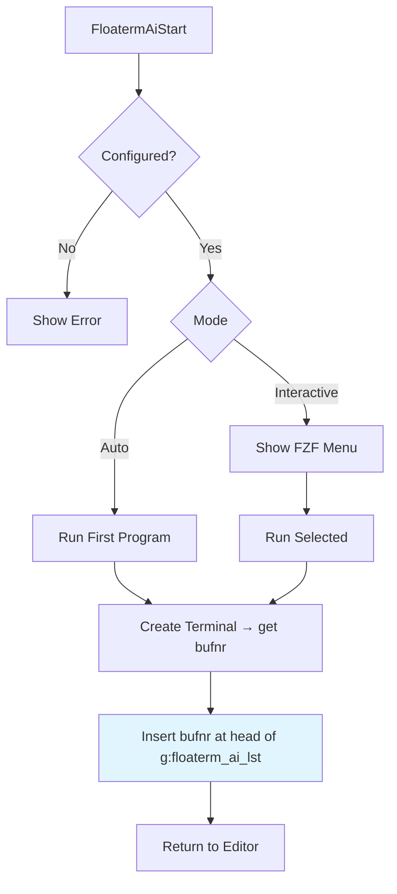
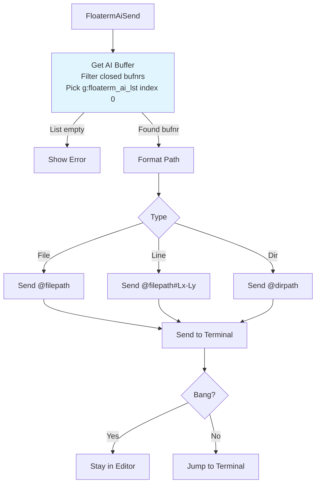
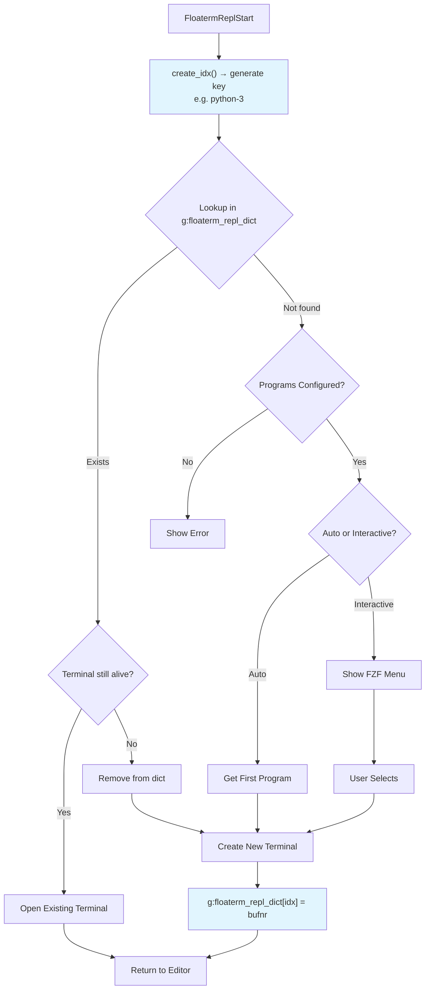
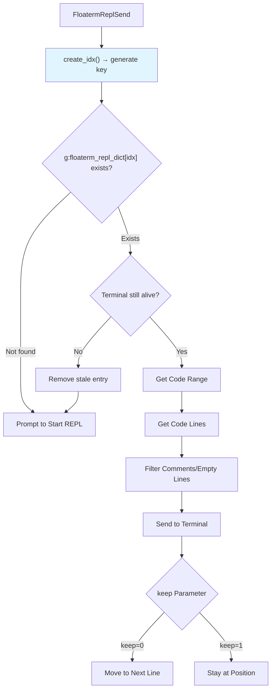
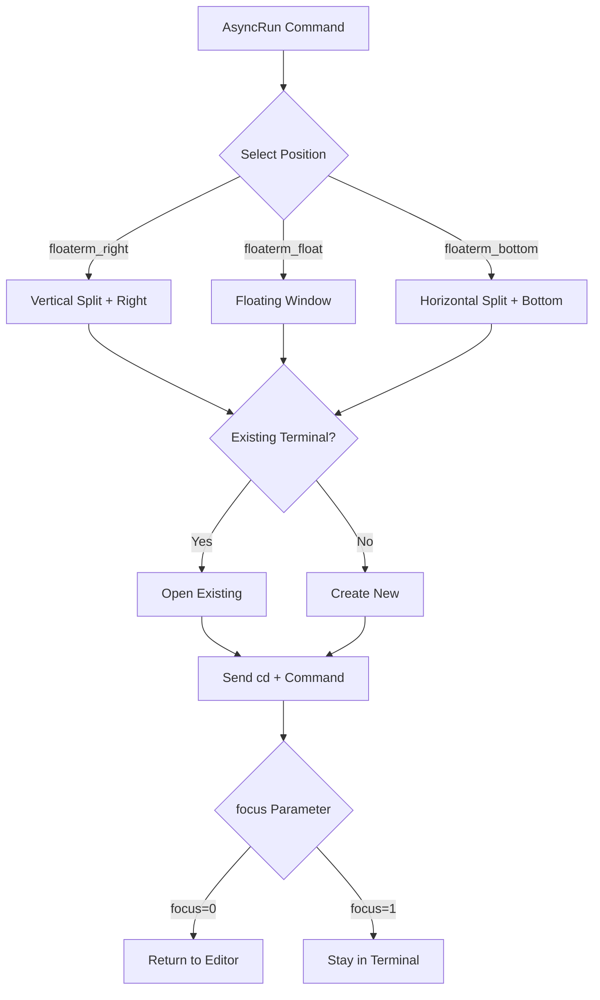

# vim-floaterm-enhance

[中文文档](README_cn.md)

An enhancement plugin for [vim-floaterm](https://github.com/voldikss/vim-floaterm). **Fully compatible with both Vim 8+ and Neovim**, offering one of the few solutions in the Vim ecosystem for direct interaction with AI CLI tools.

Leverages floaterm's floating terminal capabilities to seamlessly integrate multiple AI tools (Claude, OpenCode, etc.) and various REPLs (Python, R, Node.js, etc.), enabling code sending, command execution, and AI cli interaction without leaving your editor.

---

## 1. Requirements

**Required**
- Vim 8+ (with `:terminal`) or Neovim 0.8+
- [vim-floaterm](https://github.com/voldikss/vim-floaterm)
- [fzf.vim](https://github.com/junegunn/fzf.vim) for interactive selection

**For AI features**
- Any CLI-based AI tool: `claude`, `codex`, `opencode`, etc.

**For REPL features**
- Language-specific REPL programs: `ipython`/`python` for Python, `radian`/`R` for R, `node` for Node.js, etc.

**For AsyncRun features**
- [asyncrun.vim](https://github.com/skywind3000/asyncrun.vim)

---

## 2. Installation

**vim-plug**

```vim
Plug 'voldikss/vim-floaterm'
Plug 'leatchina/vim-floaterm-enhance'
```

**lazy.nvim**

```lua
{
  'leoatchina/vim-floaterm-enhance',
  dependencies = { 'voldikss/vim-floaterm' },
}
```

---

## 3. Configuration

### 3.0. Window Options (Shared by AI / REPL)

Both AI and REPL configuration accept floaterm window options (window opts). The plugin parses them and passes them to floaterm when creating/opening terminals.

**If omitted**, the plugin auto-determines layout based on the current window aspect ratio (`floaterm#enhance#parse_opt()`):

- If `&columns > &lines * g:floaterm_prog_col_row_ratio` (default 2.5): **right vertical split** (`vsplit --position=right`), width = `g:floaterm_prog_split_ratio` (default 0.38)
- Otherwise: **bottom horizontal split** (`split --position=bottom`), height = `g:floaterm_prog_split_ratio` (default 0.38)

**If provided**, options override the default behavior. Common options:

- **`--wintype`**: `float` / `vsplit` / `split` (Vim doesn't support `float`)
- **`--position`**: `left` / `right` / `top` / `bottom` / `topright` / ...
- **`--width` / `--height`**: ratio (float) or absolute value
- **`--title`**: terminal title

### 3.1. AI

Set `g:floaterm_ai_programs` in your vimrc:

```vim
let g:floaterm_ai_programs = [
    \ 'claude',
    \ ["codex", "--wintype=vsplit --position=right --width=0.3"],
    \ ["opencode", "--wintype=float --position=topright --width=0.45 --height=0.8", "AI"],
    \ ["zsh", "--wintype=split --position=bottom --width=0.45 --height=0.8", "SHELL"],
  \ ]
" Format: [command, floaterm window opts, label (optional)]
" Window opts are standard floaterm options: --wintype, --position, --width, --height, --title, etc.
" The third element defaults to "AI" if omitted. Non-"AI" labels won't be added to g:floaterm_ai_lst
```

### 3.2. REPL

REPL configuration works differently from AI. The plugin ships with built-in REPL programs for common languages (ipython for Python, radian for R, etc.), so most users don't need extra config.

To add your own, use `floaterm#repl#update_program()` — **don't set `g:floaterm_repl_programs` directly**. This function checks if the program is actually installed, deduplicates entries, and respects priority order:

```vim
call floaterm#repl#update_program('python', ['ipython --no-autoindent', 'python3'])
call floaterm#repl#update_program('r', ['radian', 'R'])
call floaterm#repl#update_program('javascript', ['node'])

" You can also pass floaterm window options (3rd argument, same as AI config window opts)
call floaterm#repl#update_program('julia', ['julia'], '--wintype=vsplit')
" Supports: --wintype, --position, --width, --height, --title, etc.
```

See [plugin/floaterm-repl.vim](plugin/floaterm-repl.vim) for the full list of built-in defaults.

---

## 4. AI Integration

Send files, code snippets, and directory paths to AI CLI tools without leaving Vim.

### 4.1. AI Buffer Management

All AI terminal bufnrs are stored in `g:floaterm_ai_lst` (List), with the **most recently used at the front** (MRU order). When sending content, the plugin always picks `lst[0]` as the target terminal.

- **On startup**: After creating a new AI terminal, its bufnr is `insert`ed at the head of the list
- **On switch**: Every `FloatermOpen` event checks if the opened terminal has `program == 'AI'`, and automatically moves it to the front
- **Cleanup**: Each time a bufnr is retrieved, stale entries (terminals no longer in `floaterm#buflist#gather()`) are filtered out

### 4.2. Startup Flow



### 4.3. Context Sending Flow



### 4.4. Line Range Example

`FloatermAiSendLine` formats the file path and line range as `@filepath#Lstart-Lend`, which is the file reference format recognized by Claude and other AI CLI tools:

```vim
" Suppose you are editing /home/user/project/main.py

" Normal mode, cursor on line 5:
:FloatermAiSendLine       " → sends: @/home/user/project/main.py#L5

" Visual mode, lines 10-20 selected:
:'<,'>FloatermAiSendLine  " → sends: @/home/user/project/main.py#L10-L20

" With bang, stay in editor:
:'<,'>FloatermAiSendLine! " → sends: @/home/user/project/main.py#L10-L20 (cursor stays in editor)

" Single line produces #Lx, multiple lines produce #Lx-Ly
```

### 4.5. AI Commands

| Mode | Command | Description |
| :--- | :--- | :--- |
| **Startup** |
| n | `:FloatermAiStart[!]` | Start AI. Without `!`: show selection menu. With `!`: start the first one directly |
| n | `:FloatermAiSendCr` | Send Enter to the AI terminal |
| **Send Context** |
| n/v | `:FloatermAiSendLine[!]` | Send current line or selection. With `!`: stay in editor |
| n | `:FloatermAiSendFile[!]` | Send current file path. With `!`: stay in editor |
| n | `:FloatermAiSendDir[!]` | Send current directory path. With `!`: stay in editor |
| n | `:FloatermAiFzfFiles[!]` | Pick files with FZF and send. With `!`: stay in editor |

> All Send commands: without `!` jumps to the AI terminal, with `!` keeps you in the editor. `n` = normal mode, `v` = visual mode.

---

## 5. REPL Integration

Send code from your editor to ipython, R, node, or any REPL running in a floating terminal. Supports line-by-line, code blocks, entire files, and more.

### 5.1. REPL Buffer Management

REPL terminal bufnrs are stored in `g:floaterm_repl_dict` (Dict), with keys in the format `{filetype}-{source_bufnr}`. This means **each source file can have its own independent REPL**.

- **Key generation**: `create_idx()` returns `&ft . '-' . winbufnr(winnr())`, e.g. `python-3`, `r-7`
- **On startup**: After creating a new REPL terminal, stores `{idx} → repl_bufnr` in the dict
- **On send**: Looks up the REPL bufnr by the current file's idx, and validates the terminal still exists
- **Cleanup**: If the looked-up bufnr is no longer in `floaterm#buflist#gather()`, it is automatically removed from the dict

### 5.2. Startup Flow



### 5.3. Code Sending Flow



### 5.4. Code Block Mode

`FloatermReplSendBlock` splits a file into code blocks using special comment markers, similar to Jupyter Notebook cells. The block under the cursor is sent to the REPL.

#### 5.4.1. Block Delimiters

Configured via `g:floaterm_repl_block_mark`. Built-in patterns for common languages:

| Language | Delimiter Patterns |
|----------|-------------------|
| Python / R | `# %%`, `# In[\d*]`, `# STEP\d+` |
| JavaScript | `// %%`, `// In[\d*]`, `// STEP\d+` |
| Vim | `" %%` |
| Other languages | `# %%` (default) |

#### 5.4.2. How Block Detection Works

From the cursor position, the plugin searches **backward** for the nearest delimiter (block start) and **forward** for the nearest delimiter (block end). The delimiter lines themselves are excluded from the sent content. If no delimiter is found above, the block starts from the beginning of the file; if none below, it extends to the end.

#### 5.4.3. Example

```python
# %% Data loading
import pandas as pd
df = pd.read_csv('data.csv')

# %% Data processing
df = df.dropna()
df['new_col'] = df['col_a'] * 2

# %% Visualization
import matplotlib.pyplot as plt
plt.plot(df['new_col'])
plt.show()
```

With the cursor inside the "Data processing" block, running `:FloatermReplSendBlock` sends those two lines of code to the REPL.

You can also customize delimiters:

```vim
" Override Python block markers
let g:floaterm_repl_block_mark.python = ['# %%', '# BLOCK']

" Add block markers for a new language
let g:floaterm_repl_block_mark.go = '// %%'
```

### 5.5. REPL Commands

| Mode | Command | Description |
| :--- | :--- | :--- |
| **Startup** |
| n | `:FloatermReplStart[!]` | Start REPL. Without `!`: show selection menu. With `!`: start the first one |
| n | `:FloatermReplSendCrOrStart[!]` | Send Enter; if no REPL is running, start one first. With `!`: stay in editor |
| n | `:FloatermReplSendExit` | Send exit command to REPL |
| n | `:FloatermReplSendClear` | Send clear command to REPL |
| **Send Code** |
| n/v | `:FloatermReplSend[!]` | Send current line or selection. Without `!`: move to next line. With `!`: stay |
| n/v | `:FloatermReplSendBlock[!]` | Send code block (delimited by `%%`). Without `!`: move to next line |
| n | `:FloatermReplSendToEnd!` | Send from current line to end of file |
| n | `:FloatermReplSendFromBegin!` | Send from beginning of file to current line |
| n | `:FloatermReplSendAll!` | Send entire file |
| n/v | `:FloatermReplSendWord` | Send word under cursor or selection |
| **Marks** |
| n/v | `:FloatermReplMark` | Mark selection for later sending |
| n | `:FloatermReplSendMark` | Send previously marked code |
| n | `:FloatermReplShowMark` | Show what's currently marked |

> Send commands: without `!` moves cursor to the next line (handy for step-by-step execution), with `!` keeps cursor in place. `n` = normal mode, `v` = visual mode.

---

## 6. AsyncRun Integration

Works with [asyncrun.vim](https://github.com/skywind3000/asyncrun.vim) to run commands in floating terminals. Three runners are registered automatically:

- **`floaterm_right`** — vertical split on the right
- **`floaterm_float`** — floating window
- **`floaterm_bottom`** — horizontal split at the bottom



Examples:

```vim
:AsyncRun -mode=term -pos=floaterm_float echo "Hello, World!"
:AsyncRun -mode=term -pos=floaterm_right python %
:AsyncRun -mode=term -pos=floaterm_bottom node %
```

---

## 7. Terminal List

The `:FloatermFzfList` command uses FZF to list all floaterm terminal windows for quick switching. Each entry shows the terminal's program type, buffer number, title, command, window type, and position.

```vim
:FloatermFzfList
```

---

## 8. Core Variables

| Variable | Type | Description |
|----------|------|-------------|
| `g:floaterm_ai_lst` | List | Buffer numbers of AI terminals |
| `g:floaterm_ai_programs` | List | AI program configuration |
| `g:floaterm_repl_dict` | Dict | Maps `{filetype}-{bufnr}` to REPL terminal bufnr |
| `g:floaterm_repl_programs` | Dict | Filetype to REPL command list |
| `g:floaterm_prog_split_ratio` | Float | Split window ratio, default 0.38 |
| `g:floaterm_prog_float_ratio` | Float | Float window ratio, default 0.45 |
| `g:floaterm_prog_col_row_ratio` | Float | Col/row threshold — above this uses right split instead of bottom, default 2.5 |

---

## 9. Similar Plugins

If you're on Neovim and want deeper AI integration:

- [sidekick.nvim](https://github.com/folke/sidekick.nvim) — Copilot NES + AI CLI terminal, by folke
- [avante.nvim](https://github.com/yetone/avante.nvim) — Cursor-like AI experience in Neovim
- [opencode.nvim](https://github.com/nickjvandyke/opencode.nvim) — Deep Neovim integration for opencode
- [codecompanion.nvim](https://github.com/olimorris/codecompanion.nvim) — Multi-LLM AI coding assistant

For REPL:

- [vim-repl](https://github.com/sillybun/vim-repl) — Pure Vim REPL with ipython debug support
- [iron.nvim](https://github.com/Vigemus/iron.nvim) — Neovim-native REPL in Lua
