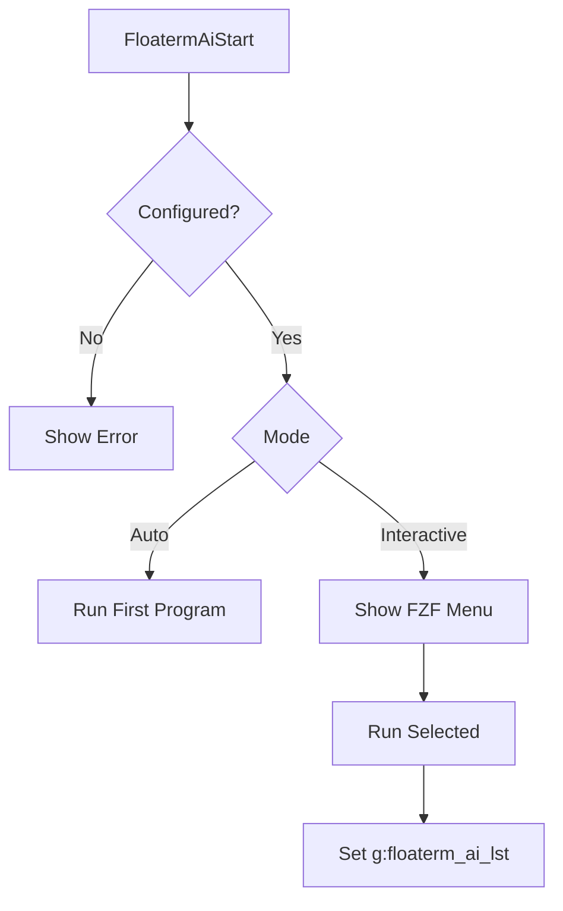
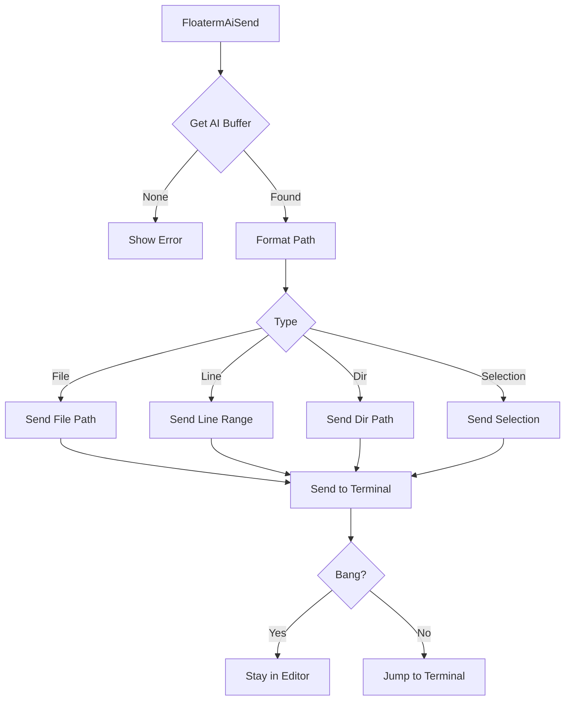
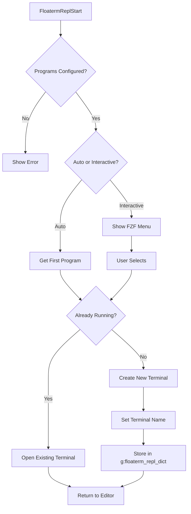
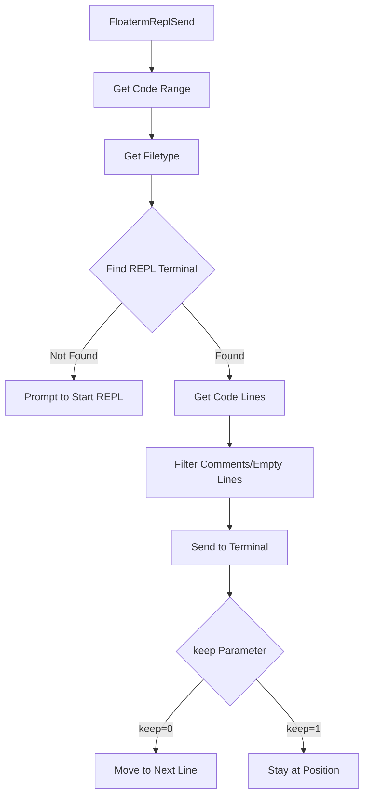
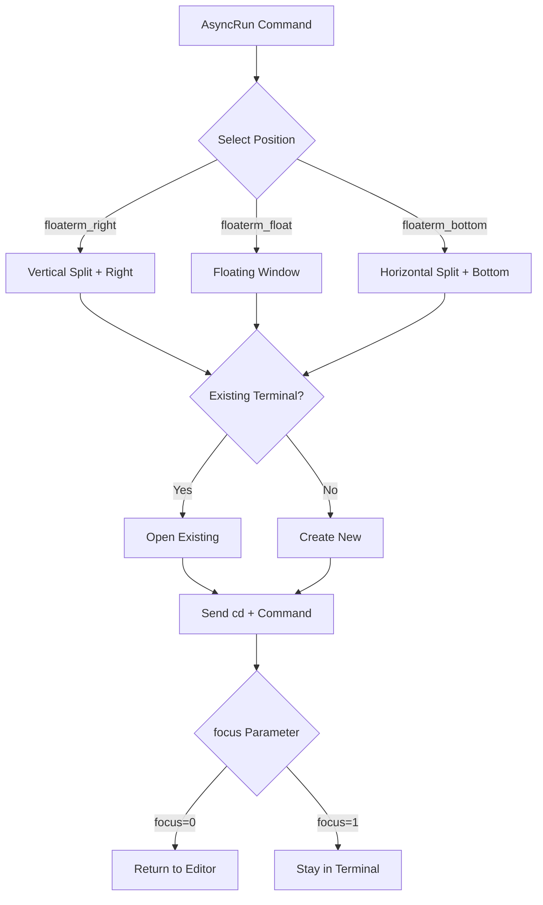

# vim-floaterm-enhance

[中文文档](README_cn.md)

An enhancement plugin for [vim-floaterm](https://github.com/voldikss/vim-floaterm). Send files and code to AI CLI tools (claude, opencode, etc.) right from Vim, run code in REPL sessions, or execute commands via AsyncRun in floating terminals.

---

# Requirements

**Required**
- Vim 8+ (with `:terminal`) or Neovim 0.8+
- [vim-floaterm](https://github.com/voldikss/vim-floaterm)
- [fzf.vim](https://github.com/junegunn/fzf.vim) for interactive selection

**For AI features**
- Any CLI-based AI tool: `claude`, `codex`, `opencode`, etc.

**For REPL features**
- Language-specific REPL programs: `ipython`/`python` for Python, `radian`/`R` for R, `node` for Node.js, etc.

**For AsyncRun features**
- [asyncrun.vim](https://github.com/skywind3000/asyncrun.vim)

---

# Installation

**vim-plug**

```vim
Plug 'voldikss/vim-floaterm'
Plug 'leatchina/vim-floaterm-enhance'
```

**lazy.nvim**

```lua
{
  'leoatchina/vim-floaterm-enhance',
  dependencies = { 'voldikss/vim-floaterm' },
}
```

---

# Configuration

## AI

Set `g:floaterm_ai_programs` in your vimrc:

```vim
let g:floaterm_ai_programs = [
    \ ["claude", "--wintype=vsplit --position=left --width=0.3"],
    \ ["opencode", "--wintype=float --position=topright --width=0.45 --height=0.8", "AI"],
  \ ]
" Format: [command, floaterm window opts, label (optional)]
" Window opts are standard floaterm options: --wintype, --position, --width, --height, etc.
" The third element defaults to "AI" if omitted.
```

## REPL

REPL configuration works differently from AI. The plugin ships with built-in REPL programs for common languages (ipython for Python, radian for R, etc.), so most users don't need extra config.

To add your own, use `floaterm#repl#update_program()` — **don't set `g:floaterm_repl_programs` directly**. This function checks if the program is actually installed, deduplicates entries, and respects priority order:

```vim
call floaterm#repl#update_program('python', ['ipython --no-autoindent', 'python3'])
call floaterm#repl#update_program('r', ['radian', 'R'])
call floaterm#repl#update_program('javascript', ['node'])

" You can also pass floaterm window options
call floaterm#repl#update_program('julia', ['julia'], '--wintype=vsplit')
```

See [plugin/floaterm-repl.vim](plugin/floaterm-repl.vim) for the full list of built-in defaults.

---

# AI Integration

Send files, code snippets, and directory paths to AI CLI tools without leaving Vim.

## Startup Flow



## Context Sending Flow



## AI Commands

| Mode | Command | Description |
| :--- | :--- | :--- |
| **Startup** |
| n | `:FloatermAiStart[!]` | Start AI. Without `!`: show selection menu. With `!`: start the first one directly |
| n | `:FloatermAiSendCr` | Send Enter to the AI terminal |
| **Send Context** |
| n/v | `:FloatermAiSendLine[!]` | Send current line or selection. With `!`: stay in editor |
| n | `:FloatermAiSendFile[!]` | Send current file path. With `!`: stay in editor |
| n | `:FloatermAiSendDir[!]` | Send current directory path. With `!`: stay in editor |
| n | `:FloatermAiFzfFiles[!]` | Pick files with FZF and send. With `!`: stay in editor |

> All Send commands: without `!` jumps to the AI terminal, with `!` keeps you in the editor. `n` = normal mode, `v` = visual mode.

---

# REPL Integration

Send code from your editor to ipython, R, node, or any REPL running in a floating terminal. Supports line-by-line, code blocks, entire files, and more.

## Startup Flow



## Code Sending Flow



## REPL Commands

| Mode | Command | Description |
| :--- | :--- | :--- |
| **Startup** |
| n | `:FloatermReplStart[!]` | Start REPL. Without `!`: show selection menu. With `!`: start the first one |
| n | `:FloatermReplSendCrOrStart[!]` | Send Enter; if no REPL is running, start one first. With `!`: stay in editor |
| n | `:FloatermReplSendExit` | Send exit command to REPL |
| n | `:FloatermReplSendClear` | Send clear command to REPL |
| **Send Code** |
| n/v | `:FloatermReplSend[!]` | Send current line or selection. Without `!`: move to next line. With `!`: stay |
| n/v | `:FloatermReplSendBlock[!]` | Send code block (delimited by `%%`). Without `!`: move to next line |
| n | `:FloatermReplSendToEnd!` | Send from current line to end of file |
| n | `:FloatermReplSendFromBegin!` | Send from beginning of file to current line |
| n | `:FloatermReplSendAll!` | Send entire file |
| n/v | `:FloatermReplSendWord` | Send word under cursor or selection |
| **Marks** |
| n/v | `:FloatermReplMark` | Mark selection for later sending |
| n | `:FloatermReplSendMark` | Send previously marked code |
| n | `:FloatermReplShowMark` | Show what's currently marked |

> Send commands: without `!` moves cursor to the next line (handy for step-by-step execution), with `!` keeps cursor in place. `n` = normal mode, `v` = visual mode.

---

# AsyncRun Integration

Works with [asyncrun.vim](https://github.com/skywind3000/asyncrun.vim) to run commands in floating terminals. Three runners are registered automatically:

- **`floaterm_right`** — vertical split on the right
- **`floaterm_float`** — floating window
- **`floaterm_bottom`** — horizontal split at the bottom



Examples:

```vim
:AsyncRun -mode=term -pos=floaterm_float echo "Hello, World!"
:AsyncRun -mode=term -pos=floaterm_right python %
:AsyncRun -mode=term -pos=floaterm_bottom node %
```

---

# Terminal List

The `:FloatermFzfList` command uses FZF to list all floaterm terminal windows for quick switching. Each entry shows the terminal's program type, buffer number, title, command, window type, and position.

```vim
:FloatermFzfList
```

---

# Core Variables

| Variable | Type | Description |
|----------|------|-------------|
| `g:floaterm_ai_lst` | List | Buffer numbers of AI terminals |
| `g:floaterm_ai_programs` | List | AI program configuration |
| `g:floaterm_repl_dict` | Dict | Maps `{filetype}-{bufnr}` to REPL terminal bufnr |
| `g:floaterm_repl_programs` | Dict | Filetype to REPL command list |
| `g:floaterm_prog_split_ratio` | Float | Split window ratio, default 0.38 |
| `g:floaterm_prog_float_ratio` | Float | Float window ratio, default 0.45 |
| `g:floaterm_prog_col_row_ratio` | Float | Col/row threshold — above this uses right split instead of bottom, default 2.5 |

---

# Similar Plugins

If you're on Neovim and want deeper AI integration:

- [sidekick.nvim](https://github.com/folke/sidekick.nvim) — Copilot NES + AI CLI terminal, by folke
- [avante.nvim](https://github.com/yetone/avante.nvim) — Cursor-like AI experience in Neovim
- [opencode.nvim](https://github.com/nickjvandyke/opencode.nvim) — Deep Neovim integration for opencode
- [codecompanion.nvim](https://github.com/olimorris/codecompanion.nvim) — Multi-LLM AI coding assistant

For REPL:

- [vim-repl](https://github.com/sillybun/vim-repl) — Pure Vim REPL with ipython debug support
- [iron.nvim](https://github.com/Vigemus/iron.nvim) — Neovim-native REPL in Lua
