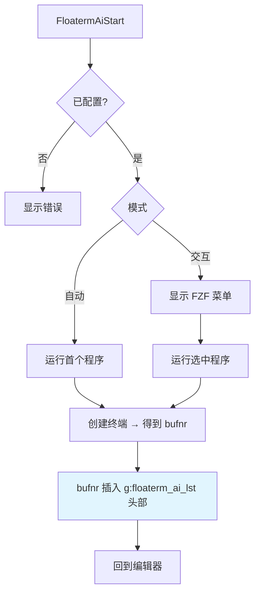
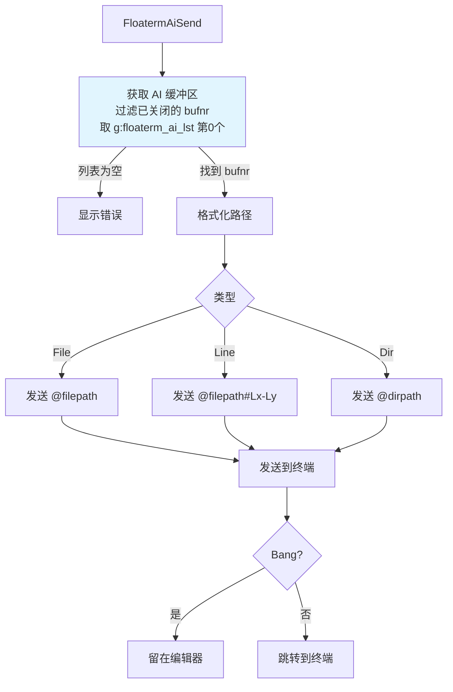
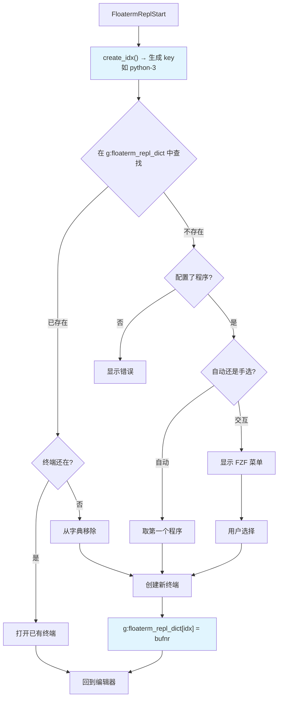
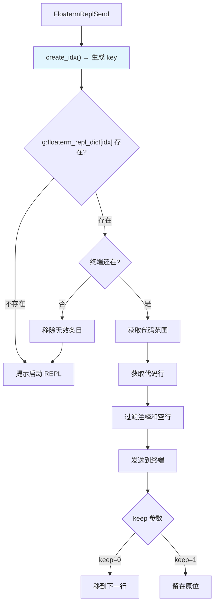
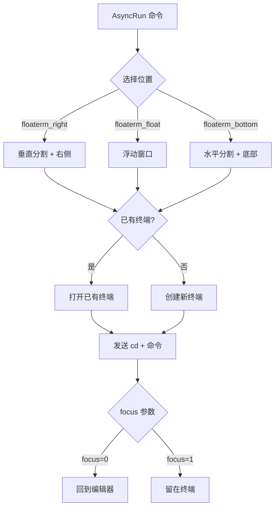

# vim-floaterm-enhance

[English](README.md)

基于 [vim-floaterm](https://github.com/voldikss/vim-floaterm) 的增强插件。**同时兼容 Vim 8+ 和 Neovim**，是 Vim 生态中少有的能直接与 AI CLI 工具交互的解决方案。

充分利用 floaterm 的浮动终端特性，无缝集成多种 AI 工具（Claude、OpenCode 等）和各类 REPL（Python、R、Node.js 等），让你在编辑器内就能完成代码发送、命令执行和 AI 交互。

---

## 1. 依赖

**必需**
- Vim 8+（要有 `:terminal`）或 Neovim 0.8+
- [vim-floaterm](https://github.com/voldikss/vim-floaterm)
- [fzf.vim](https://github.com/junegunn/fzf.vim) — 交互式选择要用

**AI 功能**
- 装一个支持 CLI 交互的 AI 工具就行，比如 `claude`、`codex`、`opencode`

**REPL 功能**
- 对应语言的 REPL 程序：Python 的 `ipython`/`python`，R 的 `radian`/`R`，Node.js 的 `node` 等

**AsyncRun 功能**
- [asyncrun.vim](https://github.com/skywind3000/asyncrun.vim)

---

## 2. 安装

**vim-plug**

```vim
Plug 'voldikss/vim-floaterm'
Plug 'leoatchina/vim-floaterm-enhance'
```

**lazy.nvim**

```lua
{
  'leoatchina/vim-floaterm-enhance',
  dependencies = { 'voldikss/vim-floaterm' },
}
```

---

## 3. 配置

### 3.1. AI 配置

在 vimrc 里设置 `g:floaterm_ai_programs`：

```vim
let g:floaterm_ai_programs = [
    \ ["claude", "--wintype=vsplit --position=left --width=0.3"],
    \ ["opencode", "--wintype=float --position=topright --width=0.45 --height=0.8", "AI"],
  \ ]
" 格式: [命令, floaterm 窗口参数, 标识(可选)]
" 窗口参数就是 floaterm 支持的那些: --wintype, --position, --width, --height 等
" 第三个参数可以不写，默认是 "AI"
```

### 3.2. REPL 配置

REPL 的配置跟 AI 不一样。插件启动时已经内置了常见语言的 REPL 程序（Python 用 ipython，R 用 radian 等等），所以大部分情况下你不需要额外配置。

如果你想加自己的 REPL 程序，推荐用 `floaterm#repl#update_program()`，**不要直接改 `g:floaterm_repl_programs`**。这个函数会自动检查程序存不存在、去重、按优先级排序：

```vim
" 在 vimrc 里加
call floaterm#repl#update_program('python', ['ipython --no-autoindent', 'python3'])
call floaterm#repl#update_program('r', ['radian', 'R'])
call floaterm#repl#update_program('javascript', ['node'])

" 也可以带 floaterm 窗口参数
call floaterm#repl#update_program('julia', ['julia'], '--wintype=vsplit')
```

插件内置的默认 REPL 列表见 [plugin/floaterm-repl.vim](plugin/floaterm-repl.vim)。

---

## 4. AI 集成

在 Vim 里写代码的时候，可以直接把文件、代码片段、目录路径丢给 claude、opencode 这些 AI CLI 工具，不用切窗口。

### 4.1. AI 缓冲区管理

所有 AI 终端的 bufnr 存在 `g:floaterm_ai_lst`（List）里，**最近使用的排在最前面**（MRU 顺序）。发送内容时，插件总是取 `lst[0]` 作为目标终端。

- **启动时**：新建 AI 终端后，bufnr 被 `insert` 到列表头部
- **切换时**：每次 `FloatermOpen` 事件触发，如果打开的终端 `program == 'AI'`，自动把它提到列表头部
- **清理**：每次获取 bufnr 时，自动过滤掉已经不存在的终端（对比 `floaterm#buflist#gather()`）

### 4.2. 启动流程



### 4.3. 发送上下文流程



### 4.4. AI 行范围示例

`FloatermAiSendLine` 会把文件路径和行范围格式化成 `@filepath#Lstart-Lend`，这是 Claude 等 AI CLI 工具能识别的文件引用格式：

```vim
" 假设当前编辑 /home/user/project/main.py

" normal 模式，光标在第 5 行:
:FloatermAiSendLine       " → 发送: @/home/user/project/main.py#L5

" visual 模式，选中第 10-20 行:
:'<,'>FloatermAiSendLine  " → 发送: @/home/user/project/main.py#L10-L20

" 带 ! 留在编辑器:
:'<,'>FloatermAiSendLine! " → 发送: @/home/user/project/main.py#L10-L20（光标留在编辑器）

" 单行时只有 #Lx，多行时是 #Lx-Ly
```

### 4.5. AI 命令

| 模式 | 命令 | 说明 |
| :--- | :--- | :--- |
| **启动** |
| n | `:FloatermAiStart[!]` | 启动 AI 程序。不带 `!` 弹出选择菜单，带 `!` 直接启动第一个 |
| n | `:FloatermAiSendCr` | 给 AI 终端发个回车 |
| **发送上下文** |
| n/v | `:FloatermAiSendLine[!]` | 发送当前行或选区。带 `!` 留在编辑器 |
| n | `:FloatermAiSendFile[!]` | 发送当前文件路径。带 `!` 留在编辑器 |
| n | `:FloatermAiSendDir[!]` | 发送当前目录路径。带 `!` 留在编辑器 |
| n | `:FloatermAiFzfFiles[!]` | 用 FZF 选文件发送。带 `!` 留在编辑器 |

> 所有 Send 命令：不带 `!` 会跳转到 AI 终端，带 `!` 留在当前编辑器。`n` = normal 模式，`v` = visual 模式。

---

## 5. REPL 集成

把编辑器里的代码直接发到 ipython、R、node 这些 REPL 里执行，支持逐行、代码块、整个文件等多种方式。

### 5.1. REPL 缓冲区管理

REPL 终端的 bufnr 存在 `g:floaterm_repl_dict`（Dict）里，key 格式为 `{filetype}-{source_bufnr}`。这意味着**每个源文件可以有自己独立的 REPL**。

- **key 生成**：由 `create_idx()` 生成，返回 `&ft . '-' . winbufnr(winnr())`，例如 `python-3`、`r-7`
- **启动时**：新建 REPL 终端后，把 `{idx} → repl_bufnr` 存入字典
- **发送时**：根据当前文件的 idx 查找对应的 REPL bufnr，并验证该终端是否仍然存在
- **清理**：如果查找到的 bufnr 已不在 `floaterm#buflist#gather()` 中，自动从字典中移除

### 5.2. 启动流程



### 5.3. 代码发送流程



### 5.4. 代码块（Block）模式

`FloatermReplSendBlock` 用专门的注释标记把文件分成多个代码块，类似 Jupyter Notebook 的 Cell。光标所在的块会被发送到 REPL。

#### 5.4.1. 块分隔符

通过 `g:floaterm_repl_block_mark` 配置，内置了常见语言的标记：

| 语言 | 分隔符模式 |
|------|----------|
| Python / R | `# %%`、`# In[\d*]`、`# STEP\d+` |
| JavaScript | `// %%`、`// In[\d*]`、`// STEP\d+` |
| Vim | `" %%` |
| 其他语言 | `# %%`（默认） |

#### 5.4.2. 块定位原理

光标所在位置向上搜索最近的分隔符作为块开始，向下搜索最近的分隔符作为块结束。分隔符行本身不包含在发送内容中。如果向上找不到分隔符，则从文件开头开始；向下找不到则到文件末尾。

#### 5.4.3. 示例

```python
# %% 数据加载
import pandas as pd
df = pd.read_csv('data.csv')

# %% 数据处理
df = df.dropna()
df['new_col'] = df['col_a'] * 2

# %% 可视化
import matplotlib.pyplot as plt
plt.plot(df['new_col'])
plt.show()
```

光标在“数据处理”块内时，执行 `:FloatermReplSendBlock` 会发送中间那两行代码到 REPL。

你也可以自定义分隔符：

```vim
" 覆盖 Python 的块标记
let g:floaterm_repl_block_mark.python = ['# %%', '# BLOCK']

" 给新语言加块标记
let g:floaterm_repl_block_mark.go = '// %%'
```

### 5.5. REPL 命令

| 模式 | 命令 | 说明 |
| :--- | :--- | :--- |
| **启动** |
| n | `:FloatermReplStart[!]` | 启动 REPL。不带 `!` 弹出选择菜单，带 `!` 直接启动第一个 |
| n | `:FloatermReplSendCrOrStart[!]` | 发个回车；如果 REPL 没启动就先启动。带 `!` 留在编辑器 |
| n | `:FloatermReplSendExit` | 给 REPL 发退出命令 |
| n | `:FloatermReplSendClear` | 给 REPL 发清屏命令 |
| **发送代码** |
| n/v | `:FloatermReplSend[!]` | 发送当前行或选区。不带 `!` 光标移到下一行，带 `!` 留在原位 |
| n/v | `:FloatermReplSendBlock[!]` | 发送代码块（用 `%%` 标记分隔）。不带 `!` 移到下一行 |
| n | `:FloatermReplSendToEnd!` | 从当前行发到文件末尾 |
| n | `:FloatermReplSendFromBegin!` | 从文件开头发到当前行 |
| n | `:FloatermReplSendAll!` | 发送整个文件 |
| n/v | `:FloatermReplSendWord` | 发送光标下的单词或选区 |
| **标记** |
| n/v | `:FloatermReplMark` | 标记选区，留着后面发 |
| n | `:FloatermReplSendMark` | 发送之前标记的代码 |
| n | `:FloatermReplShowMark` | 看一下之前标记了什么 |

> Send 命令：不带 `!` 光标跳到下一行（方便连续执行），带 `!` 光标不动。`n` = normal 模式，`v` = visual 模式。

---

## 6. AsyncRun 集成

跟 [asyncrun.vim](https://github.com/skywind3000/asyncrun.vim) 配合，在浮动终端里跑命令。插件自动注册了三个 runner：

- **`floaterm_right`** — 右侧垂直分割
- **`floaterm_float`** — 浮动窗口
- **`floaterm_bottom`** — 底部水平分割



用法示例：

```vim
:AsyncRun -mode=term -pos=floaterm_float echo "Hello, World!"
:AsyncRun -mode=term -pos=floaterm_right python %
:AsyncRun -mode=term -pos=floaterm_bottom node %
```

---

## 7. 终端列表

`:FloatermFzfList` 命令通过 FZF 列出所有 floaterm 终端窗口，方便快速切换。每个条目会显示终端的程序类型、缓冲区号、标题、命令、窗口类型和位置等信息。

```vim
:FloatermFzfList
```

---

## 8. 核心变量

| 变量 | 类型 | 说明 |
|------|------|------|
| `g:floaterm_ai_lst` | List | AI 终端的缓冲区号列表 |
| `g:floaterm_ai_programs` | List | AI 程序配置 |
| `g:floaterm_repl_dict` | Dict | `{filetype}-{bufnr}` → REPL 终端 bufnr 的映射 |
| `g:floaterm_repl_programs` | Dict | 文件类型 → REPL 命令列表 |
| `g:floaterm_prog_split_ratio` | Float | 分割窗口比例，默认 0.38 |
| `g:floaterm_prog_float_ratio` | Float | 浮动窗口比例，默认 0.45 |
| `g:floaterm_prog_col_row_ratio` | Float | 宽高比阈值，超过这个值自动用右侧分割而不是底部，默认 2.5 |

---

## 9. 类似插件

如果你用 Neovim 想要更深度的 AI 集成，可以看看这些：

- [sidekick.nvim](https://github.com/folke/sidekick.nvim) — Copilot NES + AI CLI 终端，folke 出品
- [avante.nvim](https://github.com/yetone/avante.nvim) — 在 Neovim 里复刻 Cursor 的体验
- [opencode.nvim](https://github.com/nickjvandyke/opencode.nvim) — opencode 的 Neovim 深度集成
- [codecompanion.nvim](https://github.com/olimorris/codecompanion.nvim) — 支持多家 LLM 的 AI 编码助手

REPL 方面：

- [vim-repl](https://github.com/sillybun/vim-repl) — 纯 Vim 的 REPL，支持 ipython 调试
- [iron.nvim](https://github.com/Vigemus/iron.nvim) — Neovim Lua 生态的 REPL 方案
